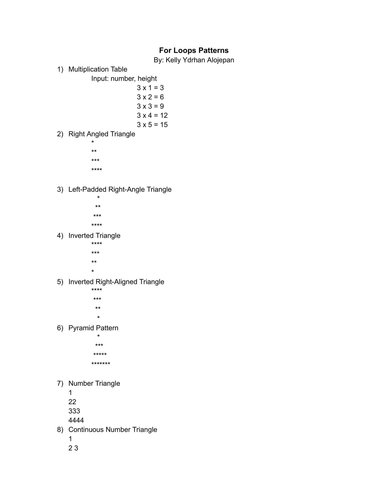
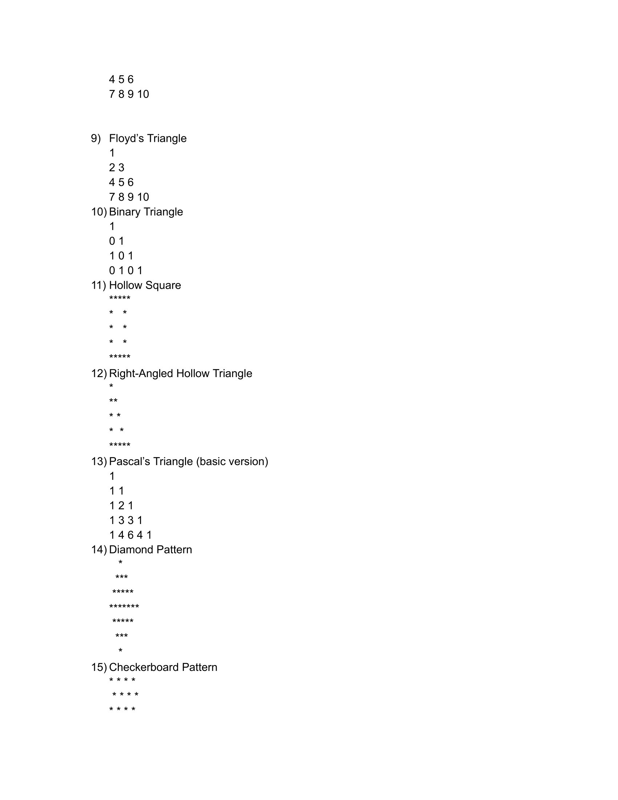
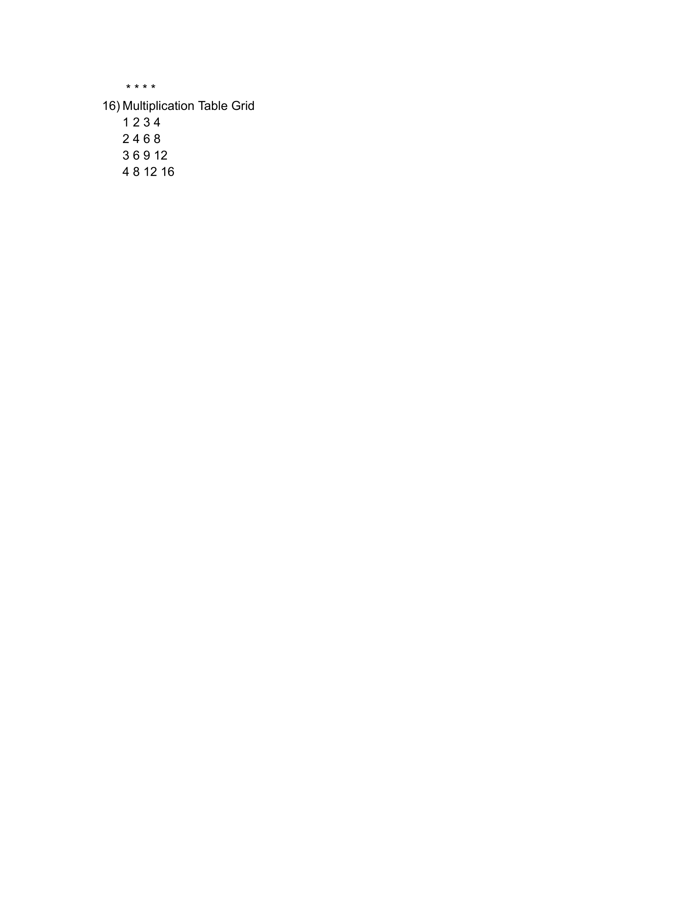

# For-loop-patterns
This repository contains a curated list of **20 common and fundamental `for` loop patterns** implemented in C++. Each pattern is designed to help learners practice iteration, conditionals, and pattern generation in a progressive and structured way.

  
  
  

